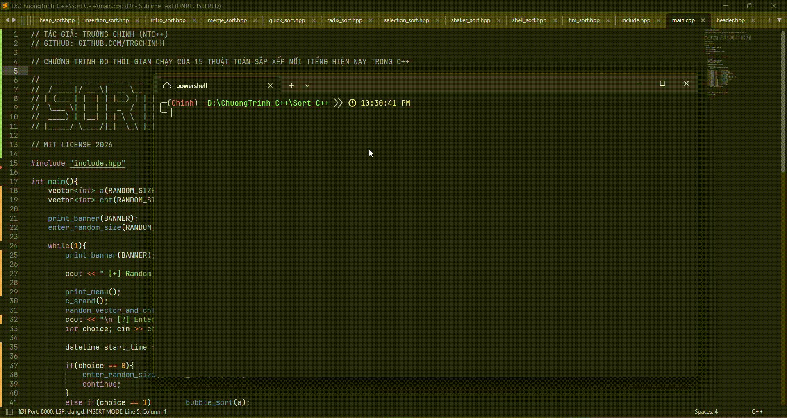

<p align="center">
    
</p>


## Sorting Algorithm

Đây là một dự án nhỏ dùng để đo thời gian thực thi của 15 thuật toán sắp xếp phổ biến trong C++, đồng thời cũng là những thuật toán được sử dụng rộng rãi trong nhiều ngôn ngữ lập trình khác. Dự án hướng đến những người mới học lập trình, giúp họ có cái nhìn tổng quan và dễ dàng tiếp cận các thuật toán sắp xếp thông qua việc so sánh hiệu năng thực tế.

## Video demo



---

## Danh sách thuật toán

| STT | Thuật toán | Tính ổn định |
|:---:|------------|:------------:|
| 01 | [Bubble Sort](#01-bubble-sort) | Ổn định |
| 02 | [Selection Sort](#02-selection-sort) | Không ổn định |
| 03 | [Insertion Sort](#03-insertion-sort) | Ổn định |
| 04 | [Binary Insertion Sort](#04-binary-insertion-sort) | Ổn định |
| 05 | [Shaker Sort](#05-shaker-sort) | Ổn định |
| 06 | [Shell Sort](#06-shell-sort) | Không ổn định |
| 07 | [Quick Sort](#07-quick-sort) | Không ổn định |
| 08 | [Merge Sort](#08-merge-sort) | Ổn định |
| 09 | [Heap Sort](#09-heap-sort) | Không ổn định |
| 10 | [Counting Sort](#10-counting-sort) | Ổn định |
| 11 | [Radix Sort](#11-radix-sort) | Ổn định |
| 12 | [Bucket Sort](#12-bucket-sort) | Phụ thuộc thuật toán sắp xếp bên trong |
| 13 | [Flash Sort](#13-flash-sort) | Không ổn định |
| 14 | [Tim Sort](#14-tim-sort) | Ổn định |
| 15 | [Intro Sort](#15-intro-sort) | Không ổn định |

---

## 01. Bubble sort

Bubble Sort là một trong những thuật toán sắp xếp đơn giản và dễ hiểu nhất. Thuật toán hoạt động bằng cách liên tục so sánh hai phần tử kề nhau và hoán đổi chúng nếu chúng đang sai thứ tự. Sau mỗi lượt duyệt, phần tử lớn nhất sẽ dần "nổi" về cuối mảng, vì vậy thuật toán có tên là Bubble Sort. 

| Độ phức tạp | Giá trị |
|-------------|:-------:|
| Trường hợp trung bình | `O(n²)` |
| Trường hợp tốt nhất | `O(n)` |
| Trường hợp xấu nhất | `O(n²)` |
| Độ phức tạp không gian | `O(1)` |

**Ưu điểm:** của thuật toán là dễ hiểu, dễ cài đặt và phù hợp cho người mới học. 
**Nhược điểm:** là hiệu năng thấp, có độ phức tạp trung bình và tệ nhất là O(n²), nên được xem là một trong những thuật toán sắp xếp kém hiệu quả đối với tập dữ liệu lớn.

---

## 02. Selection Sort

Selection Sort là một thuật toán sắp xếp đơn giản hoạt động bằng cách liên tục tìm phần tử nhỏ nhất trong phần chưa được sắp xếp và đưa nó về đúng vị trí ở đầu mảng. Sau mỗi lượt duyệt, vùng dữ liệu đã được sắp xếp sẽ tăng thêm một phần tử cho đến khi toàn bộ mảng được sắp xếp hoàn chỉnh.

| Độ phức tạp | Giá trị |
|-------------|:-------:|
| Trường hợp trung bình | `O(n²)` |
| Trường hợp tốt nhất | `O(n²)` |
| Trường hợp xấu nhất | `O(n²)` |
| Độ phức tạp không gian | `O(1)` |

**Ưu điểm:** dễ hiểu, dễ cài đặt, số lần hoán đổi ít hơn Bubble Sort và không cần sử dụng thêm bộ nhớ.

**Nhược điểm:** luôn phải duyệt toàn bộ phần còn lại của mảng để tìm phần tử nhỏ nhất, vì vậy hiệu năng không cao và độ phức tạp luôn là `O(n²)` trong hầu hết các trường hợp.

---

## 03. Insertion Sort

Insertion Sort hoạt động bằng cách chia mảng thành hai phần: phần đã được sắp xếp và phần chưa được sắp xếp. Thuật toán lần lượt lấy từng phần tử ở phần chưa sắp xếp và chèn vào đúng vị trí trong phần đã sắp xếp cho đến khi toàn bộ mảng được sắp xếp.

| Độ phức tạp | Giá trị |
|-------------|:-------:|
| Trường hợp trung bình | `O(n²)` |
| Trường hợp tốt nhất | `O(n)` |
| Trường hợp xấu nhất | `O(n²)` |
| Độ phức tạp không gian | `O(1)` |

**Ưu điểm:** dễ cài đặt, hoạt động rất tốt với mảng có kích thước nhỏ hoặc gần như đã được sắp xếp.

**Nhược điểm:** hiệu năng giảm đáng kể khi xử lý dữ liệu lớn do có độ phức tạp `O(n²)`.

---

## 04. Binary Insertion Sort

Binary Insertion Sort là phiên bản cải tiến của Insertion Sort. Thuật toán sử dụng tìm kiếm nhị phân để xác định vị trí cần chèn phần tử, giúp giảm số lần so sánh nhưng vẫn phải dịch chuyển các phần tử phía sau.

| Độ phức tạp | Giá trị |
|-------------|:-------:|
| Trường hợp trung bình | `O(n²)` |
| Trường hợp tốt nhất | `O(n log n)` |
| Trường hợp xấu nhất | `O(n²)` |
| Độ phức tạp không gian | `O(1)` |

**Ưu điểm:** giảm số lần so sánh so với Insertion Sort thông thường và hoạt động tốt với mảng nhỏ.

**Nhược điểm:** vẫn phải dịch chuyển dữ liệu nên độ phức tạp tổng thể vẫn là `O(n²)`.

---

## 05. Shaker Sort

Shaker Sort (hay Cocktail Sort) là phiên bản cải tiến của Bubble Sort. Thuật toán thực hiện việc sắp xếp theo cả hai chiều từ trái sang phải và từ phải sang trái trong mỗi lượt duyệt, giúp các phần tử nhanh chóng di chuyển về đúng vị trí.

| Độ phức tạp | Giá trị |
|-------------|:-------:|
| Trường hợp trung bình | `O(n²)` |
| Trường hợp tốt nhất | `O(n)` |
| Trường hợp xấu nhất | `O(n²)` |
| Độ phức tạp không gian | `O(1)` |

**Ưu điểm:** hiệu quả hơn Bubble Sort khi các phần tử nhỏ nằm gần cuối mảng.

**Nhược điểm:** vẫn có độ phức tạp `O(n²)` và không phù hợp với dữ liệu lớn.

---

## 06. Shell Sort

Shell Sort là thuật toán cải tiến của Insertion Sort bằng cách chia mảng thành nhiều nhóm với khoảng cách (gap) nhất định, sau đó giảm dần khoảng cách cho đến khi bằng 1.

| Độ phức tạp | Giá trị |
|-------------|:-------:|
| Trường hợp trung bình | `O(n log² n)` |
| Trường hợp tốt nhất | `O(n log n)` |
| Trường hợp xấu nhất | `O(n²)` |
| Độ phức tạp không gian | `O(1)` |

**Ưu điểm:** nhanh hơn Insertion Sort đối với mảng có kích thước trung bình và không cần thêm bộ nhớ.

**Nhược điểm:** hiệu năng phụ thuộc nhiều vào dãy khoảng cách (gap sequence) được lựa chọn.

---

## 07. Quick Sort

Quick Sort là một thuật toán sắp xếp dựa trên kỹ thuật **chia để trị (Divide and Conquer)**. Thuật toán bắt đầu bằng cách chọn một phần tử làm **pivot (phần tử chốt)**, sau đó phân hoạch (partition) mảng thành hai phần: một phần chứa các phần tử nhỏ hơn pivot và phần còn lại chứa các phần tử lớn hơn hoặc bằng pivot. Quá trình này được lặp lại đệ quy trên từng nửa của mảng cho đến khi toàn bộ mảng được sắp xếp.

| Độ phức tạp | Giá trị |
|-------------|:-------:|
| Trường hợp trung bình | `O(n log n)` |
| Trường hợp tốt nhất | `O(n log n)` |
| Trường hợp xấu nhất | `O(n²)` |
| Độ phức tạp không gian | `O(log n)` |

**Ưu điểm:** có tốc độ rất nhanh trong thực tế, hoạt động hiệu quả với dữ liệu lớn, ít tốn bộ nhớ và được sử dụng rộng rãi trong nhiều thư viện và ứng dụng.

**Nhược điểm:** hiệu năng phụ thuộc vào cách chọn pivot. Nếu pivot được chọn không hợp lý (ví dụ mảng đã được sắp xếp sẵn và luôn chọn phần tử đầu hoặc cuối làm pivot), thuật toán có thể giảm xuống độ phức tạp `O(n²)`.


---

## 08. Merge Sort

Merge Sort là thuật toán sắp xếp dựa trên phương pháp **chia để trị (Divide and Conquer)**. Thuật toán liên tục chia mảng thành hai nửa nhỏ cho đến khi mỗi mảng con chỉ còn một phần tử. Sau đó các mảng con được **trộn (merge)** lại theo đúng thứ tự để tạo thành mảng đã sắp xếp.

| Độ phức tạp | Giá trị |
|-------------|:-------:|
| Trường hợp trung bình | `O(n log n)` |
| Trường hợp tốt nhất | `O(n log n)` |
| Trường hợp xấu nhất | `O(n log n)` |
| Độ phức tạp không gian | `O(n)` |

**Ưu điểm:** hiệu năng ổn định, luôn đạt `O(n log n)` trong mọi trường hợp, là thuật toán **Stable** (giữ nguyên thứ tự các phần tử bằng nhau) và rất phù hợp để sắp xếp danh sách liên kết hoặc dữ liệu ngoài bộ nhớ.

**Nhược điểm:** cần sử dụng thêm bộ nhớ để lưu mảng tạm trong quá trình trộn nên tốn nhiều bộ nhớ hơn Quick Sort hoặc Heap Sort.

---

## 09. Heap Sort

Heap Sort hoạt động bằng cách xây dựng một **Heap** (thường là Max Heap) từ mảng ban đầu. Sau khi Heap được tạo, phần tử lớn nhất luôn nằm ở gốc của Heap. Thuật toán sẽ đưa phần tử này về cuối mảng, giảm kích thước Heap và tiếp tục lặp lại cho đến khi toàn bộ mảng được sắp xếp.

| Độ phức tạp | Giá trị |
|-------------|:-------:|
| Trường hợp trung bình | `O(n log n)` |
| Trường hợp tốt nhất | `O(n log n)` |
| Trường hợp xấu nhất | `O(n log n)` |
| Độ phức tạp không gian | `O(1)` |

**Ưu điểm:** luôn đạt độ phức tạp `O(n log n)`, không cần nhiều bộ nhớ phụ và không bị giảm hiệu năng trong trường hợp xấu như Quick Sort.

**Nhược điểm:** thường chậm hơn Quick Sort trên thực tế do thao tác Heap có chi phí lớn hơn và đây không phải là thuật toán Stable.

---

## 10. Counting Sort

Counting Sort là thuật toán sắp xếp **không dựa trên phép so sánh**. Thuật toán hoạt động bằng cách tạo một mảng đếm để lưu số lần xuất hiện của từng giá trị, sau đó sử dụng thông tin này để xây dựng lại mảng theo đúng thứ tự tăng dần.

| Độ phức tạp | Giá trị |
|-------------|:-------:|
| Trường hợp trung bình | `O(n+k)` |
| Trường hợp tốt nhất | `O(n+k)` |
| Trường hợp xấu nhất | `O(n+k)` |
| Độ phức tạp không gian | `O(k)` |

**Ưu điểm:** tốc độ rất nhanh khi dữ liệu là số nguyên và phạm vi giá trị (`k`) không quá lớn. Đây là nền tảng của nhiều thuật toán khác như Radix Sort.

**Nhược điểm:** chỉ áp dụng tốt cho dữ liệu số nguyên có phạm vi giá trị nhỏ. Nếu `k` quá lớn, bộ nhớ sử dụng sẽ tăng đáng kể.

---

## 11. Radix Sort

Radix Sort là thuật toán sắp xếp **không dựa trên phép so sánh**, hoạt động bằng cách sắp xếp dữ liệu theo từng chữ số từ hàng đơn vị đến hàng lớn nhất (LSD) hoặc ngược lại (MSD). Mỗi lượt sắp xếp thường sử dụng Counting Sort để đảm bảo tính ổn định.

| Độ phức tạp | Giá trị |
|-------------|:-------:|
| Trường hợp trung bình | `O(nk)` |
| Trường hợp tốt nhất | `O(nk)` |
| Trường hợp xấu nhất | `O(nk)` |
| Độ phức tạp không gian | `O(n+k)` |

**Ưu điểm:** rất nhanh đối với số nguyên hoặc chuỗi có độ dài cố định, đặc biệt khi số lượng phần tử lớn.

**Nhược điểm:** chỉ phù hợp với một số kiểu dữ liệu nhất định và phụ thuộc vào số lượng chữ số của dữ liệu.

---

## 12. Bucket Sort

Bucket Sort hoạt động bằng cách chia dữ liệu thành nhiều **Bucket (thùng chứa)** dựa trên khoảng giá trị. Sau đó mỗi Bucket sẽ được sắp xếp riêng (thường bằng Insertion Sort hoặc Quick Sort) trước khi ghép lại thành mảng hoàn chỉnh.

| Độ phức tạp | Giá trị |
|-------------|:-------:|
| Trường hợp trung bình | `O(n+k)` |
| Trường hợp tốt nhất | `O(n+k)` |
| Trường hợp xấu nhất | `O(n²)` |
| Độ phức tạp không gian | `O(n+k)` |

**Ưu điểm:** đạt hiệu năng rất cao nếu dữ liệu phân bố đồng đều và có thể gần đạt `O(n)` trong thực tế.

**Nhược điểm:** hiệu quả phụ thuộc mạnh vào cách chia Bucket và phân bố dữ liệu. Nếu dữ liệu phân bố không đều, hiệu năng có thể giảm xuống `O(n²)`.


---

## 13. Flash Sort

Flash Sort là thuật toán sắp xếp kết hợp giữa **phân lớp dữ liệu (Classification)** và **Insertion Sort**. Thuật toán trước tiên ước lượng sự phân bố của dữ liệu để chia thành các lớp (Class), sau đó đưa các phần tử về đúng lớp trước khi hoàn tất việc sắp xếp bằng Insertion Sort.

| Độ phức tạp | Giá trị |
|-------------|:-------:|
| Trường hợp trung bình | `O(n)` |
| Trường hợp tốt nhất | `O(n)` |
| Trường hợp xấu nhất | `O(n²)` |
| Độ phức tạp không gian | `O(n)` |

**Ưu điểm:** có thể đạt tốc độ gần `O(n)` trên dữ liệu phân bố tương đối đồng đều và thường nhanh hơn nhiều thuật toán truyền thống.

**Nhược điểm:** thuật toán khá khó cài đặt và hiệu năng giảm đáng kể nếu dữ liệu phân bố không đều.

---

## 14. Tim Sort

Tim Sort là thuật toán lai (Hybrid Sort) kết hợp giữa **Insertion Sort** và **Merge Sort**. Thuật toán sẽ tìm các đoạn dữ liệu đã có thứ tự (Run), sử dụng Insertion Sort để sắp xếp các đoạn nhỏ rồi hợp nhất chúng bằng Merge Sort.

| Độ phức tạp | Giá trị |
|-------------|:-------:|
| Trường hợp trung bình | `O(n log n)` |
| Trường hợp tốt nhất | `O(n)` |
| Trường hợp xấu nhất | `O(n log n)` |
| Độ phức tạp không gian | `O(n)` |

**Ưu điểm:** rất nhanh trên dữ liệu thực tế, đặc biệt với mảng gần như đã được sắp xếp. Đây là thuật toán **Stable** và được sử dụng trong Python (`list.sort()`, `sorted()`) và Java (`Arrays.sort()` đối với Object).

**Nhược điểm:** cài đặt phức tạp và cần thêm bộ nhớ để thực hiện quá trình Merge.

---

## 15. Intro Sort

Intro Sort (Introspective Sort) là thuật toán lai kết hợp giữa **Quick Sort**, **Heap Sort** và **Insertion Sort**. Thuật toán bắt đầu bằng Quick Sort để tận dụng tốc độ cao. Khi độ sâu đệ quy vượt quá một ngưỡng nhất định, nó sẽ chuyển sang Heap Sort để tránh trường hợp xấu `O(n²)`. Đối với các đoạn dữ liệu nhỏ, thuật toán sử dụng Insertion Sort nhằm giảm chi phí xử lý.

| Độ phức tạp | Giá trị |
|-------------|:-------:|
| Trường hợp trung bình | `O(n log n)` |
| Trường hợp tốt nhất | `O(n log n)` |
| Trường hợp xấu nhất | `O(n log n)` |
| Độ phức tạp không gian | `O(log n)` |

**Ưu điểm:** kết hợp được ưu điểm của nhiều thuật toán, có hiệu năng rất cao, ổn định và luôn đảm bảo độ phức tạp `O(n log n)` trong trường hợp xấu. Đây cũng là thuật toán được `std::sort()` của thư viện chuẩn C++ sử dụng (trên hầu hết các trình biên dịch hiện đại).

**Nhược điểm:** cài đặt phức tạp hơn nhiều so với các thuật toán sắp xếp cơ bản và khó tự triển khai nếu chưa nắm vững các thuật toán thành phần.

---

## Cách cài đặt 
Yêu cầu Msys2/Mingw64 C++ 14 trở lên
```bash
git clone https://github.com/trgchinhh/sorting-algorithm.git
cd sorting-algorithm
g++ ./main.cpp -o ./main.exe
./main.exe
```

---

## Tác giả
**Nguyễn Trường Chinh (NTC++)**<br>
**Ủng hộ:** [Nếu bạn thấy hữu ích hãy ủng hộ mình](https://github.com/sponsors/trgchinhh)<br>
**GitHub:** [https://github.com/trgchinhh](https://github.com/trgchinhh)

---

> 📌 Dự án nhỏ được phát triển với mục đích học tập và nghiên cứu. Mọi góp ý và đóng góp đều được hoan nghênh. Nếu thấy dự án này thú vị hoặc hữu ích cho bạn, hãy tặng 1 sao cho repo này !!!
